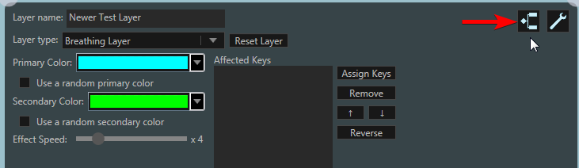
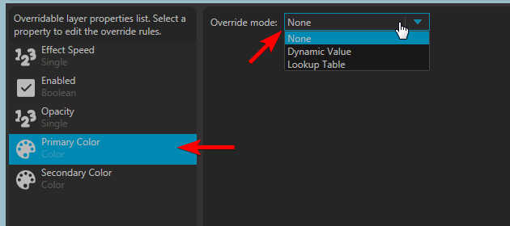
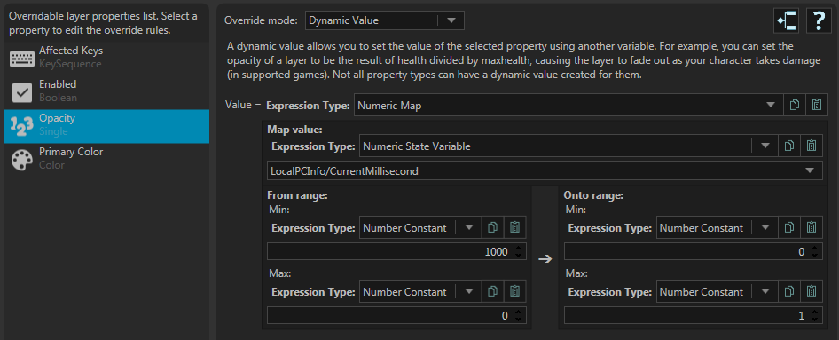
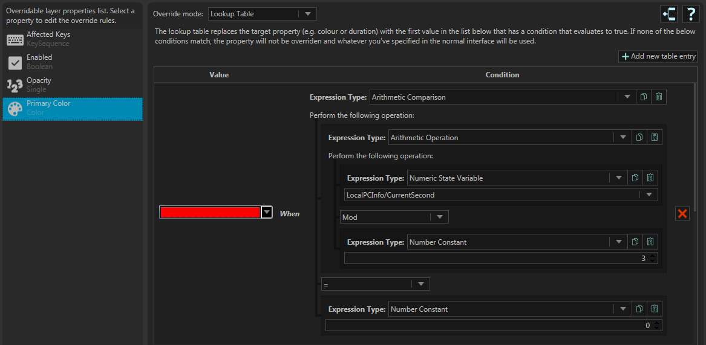
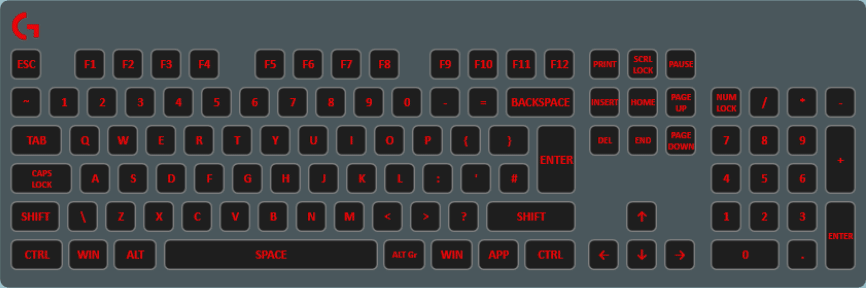

The overrides system is an an advanced system that allows you to override the properties of layers with other values that are evaluated each frame. This allows for a huge amount of control and customizability with your lighting that layers on their own cannot provide. You can still get fairly customization layers without this system, so do not worry if you don't understand it. This is a feature mainly for advanced users.

The overrides system works by providing you, the user, the ability to use one of several techniques to override individual properties with custom values. If no override is provided, the value you've set on the normal properties editor panel will be used instead. Overrides are done on a per-property basis, so you can use one technique for one property, a different one for another property or no technique for a third for example.

# The Editor
To open the overrides editor panel, first select the layer whose properties you want to override then click on the left-most button in the top right of the properties panel.

The editor is split into two columns. The left column contains a list of all overridable properties on the selected layer, showing their name and type. Note that not all properties are overridable. The right hand (larger) column is where the main logic editor is. This area is how you choose and edit the override technique. Initially, only a drop down box will be shown with an empty area.

To actually setup an override for a property, select it from the property list, then choose an override mode from the drop down list.

# Override Modes
## Dynamic Value
The dynamic value override method allows you to dynamically create a value based on values of other variables.

A simple example for this could be assigning to opacity of a layer to be the health of a player, so it appears to fade in as the health lowers, showing a red warning when your character is close to death. A more complex example could be constructing a color based on the current time, with seconds being red, minutes green and hours blue. Whether you'd actually want this who knows, but it's possible with this override technique.

Depending on the type of property being edited, you will be asked to provide one or more expressions of different types. Descriptions of these expressions are available in the "Reference: Expression Types" section of the guide. For example, the "Enabled" property will require a [boolean expression](../reference-expressions/boolean-expressions) and "Opacity" will require a [numeric expression](../reference-expressions/numeric-expressions).

## Lookup Table

The lookup table is a list of condition-value pairs. When using this override technique, Aurora will evaluate the [boolean condition expression](../reference-expressions/boolean-expressions) of each item in the list until it finds one that is true. When it does so, it will override the requested property with the value of the pair.

If you are familiar with the concept of programming, you can think of a lookup table as being like a switch statement or a collection of `if else if` blocks.

# Demos
This profile contains a *single solid fill layer* that fades in and out every second, each second alternating between red, green and blue.

[You can download the demo profile here.](../../assets/overrides-rgb-flash-demo.json)