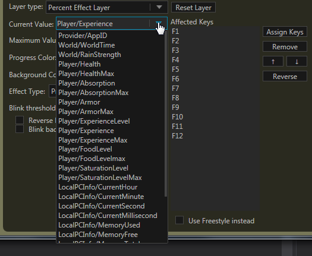

# What are State Variables?
State Variables are numeric, boolean (true/false) or string (sequence of letters) values that can be obtained and dynamically updated by Aurora as it is running. Layers such as the Percent Effect Layer or the Animation Layer can make use of these values to conditionally set the lights on the keyboard. The values depend on which profile is currently in use, for example the CSGO profile contains State Variables for health, current ammo, max ammo, etc. but these specific ones do not work for other profiles such as Minecraft.

Not all game profiles that come with Aurora have State Integration, and currently custom added profiles also do not support State Variables.

There are some State Variables that are operating system-wide (such as RAM/CPU usage and time values) and these are always available to use, regardless of the application a profile is on.

# How do you use State Variables?
Any layers that support the use of State Variables will present you with a drop down box allowing you to select a State Variable from the current application profile.

Note that in most circumstances, the drop down list is editable you are able to type a number into the field to use that instead of referencing a State Variable.

Another use for State Variables is in the [Overrides System](../advanced-topics/overrides-system). This system allows you to override property values of the layers when certain conditions are met. These conditions can be based on State Variables, such as showing a layer when your health is less than 25%.