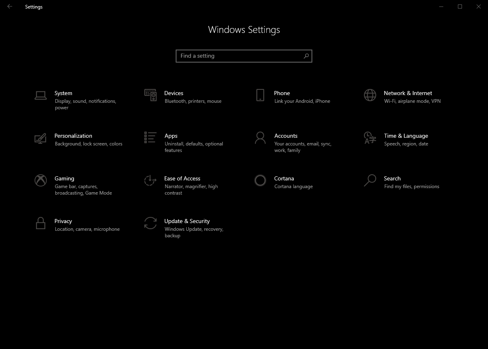
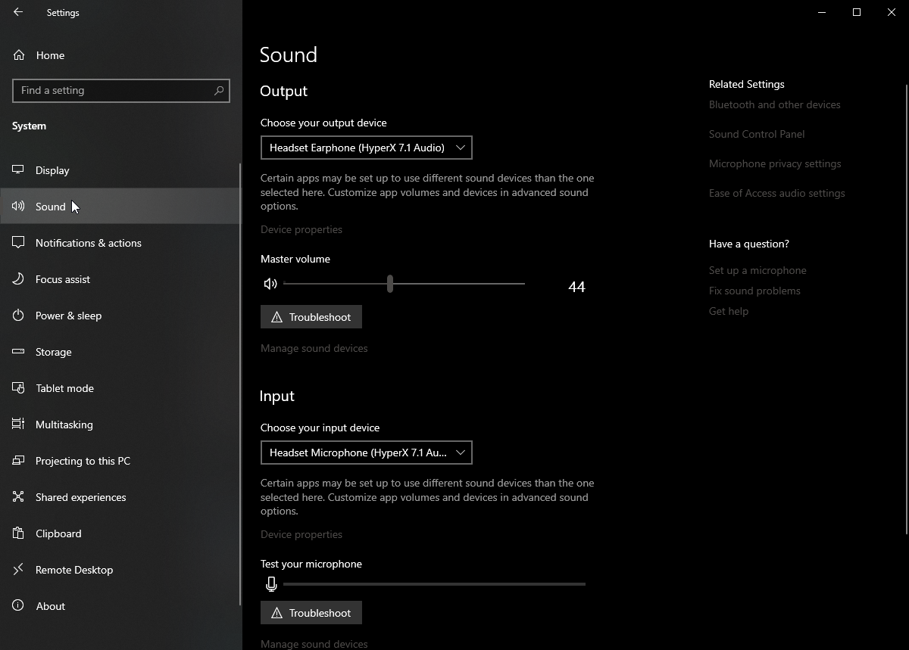
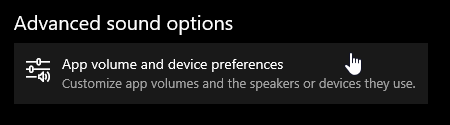
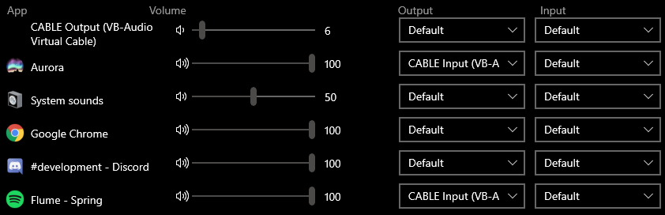
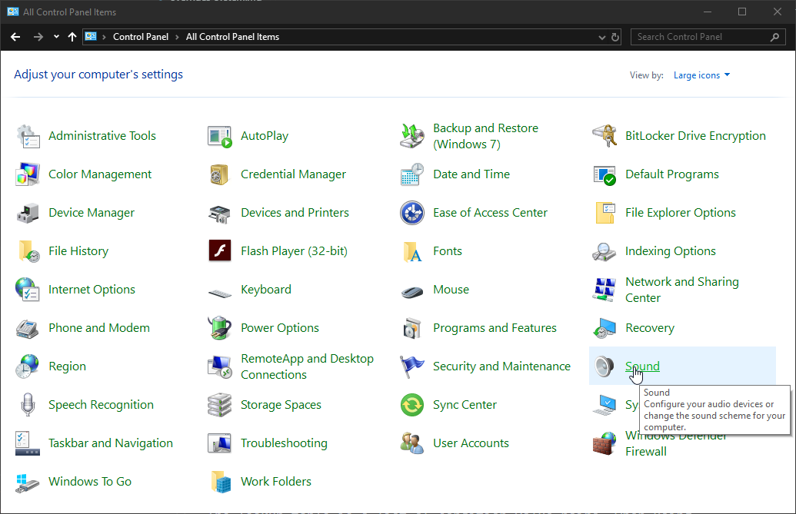
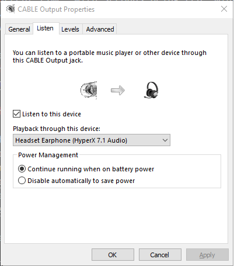
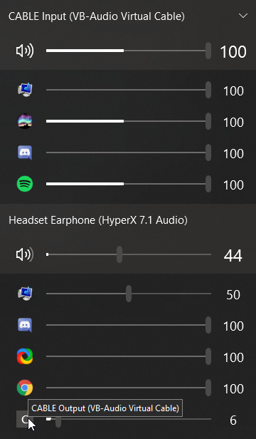

The Audio Visualizer layer allows you to display a representation of whatever you're listening to on your RGB devices.

# Isolating applications

### Why
One of the things that annoys me about the layer is that every single sound your computer emits will be shown on the keyboard, which isn't very useful or appealing if you're talking to someone on Discord for example. So I found a way to isolate a single application (in my case, spotify) in the same audio output as Aurora.

This makes it so only sound emitted by Spotify is processed and displayed on the keyboard, and does make the visualization change if you change the volume of the music.

### Prerequisites
* Windows 19 build 1809 or above
  - Aurora doesn't let you pick the audio output device yet. Windows now has a menu where you can force an application to use an output and input device of your choosing.

* [Virtual Audio Cable](https://www.vb-audio.com/Cable/)
  - We need this so we can listen to 2 output devices at once: The default output every application should emit to, and the virtual audio cable we need for Aurora's visualizer.

### How
1. Open the Windows Settings app (Win + i).
  
2. Click the System button, then select the Sound tab.
  
3. Scroll down to the bottom and click "App volume and device preferences".
  
4. Set both Aurora's and whatever other application you want to be visible's Output to "CABLE Input". Then Input option does not need to be changed for this.
  
5. Open the legacy Sound settings window. The easiest way is through Control Panel -> Icons view.
  
6. Choose the Recording Tab and double-click "CABLE Output". Select the Listen Tab.
7. Tick "Listen to this device" and choose your headphones/speakers. You should now be able to listen to music!
  

(*Optional*) Install Ear Trumpet from the Windows Store to more easily change the volume of Spotify. This method works best if you leave Spotify's volume at 100% and adjust using the windows mixer instead. This way, Aurora sees every song at the same volume at all times, producing a more consistent effect.
  
