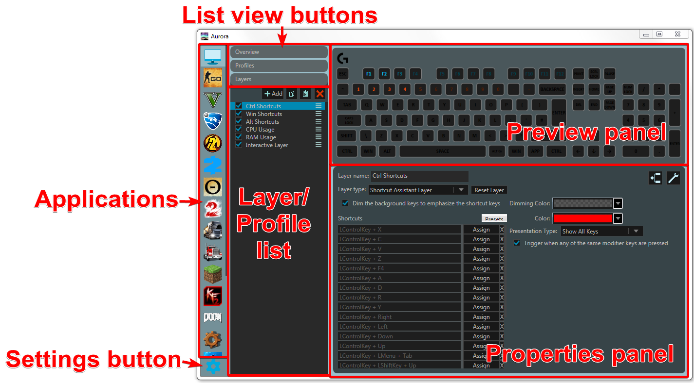
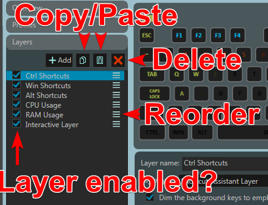

When you first open Aurora, you will be presented with a window that looks like the following.

# Applications
On the far left is the **application** list, with each application shown as an icon. All the applications and games you will see here by default have some sort of integration or preset profile. You are not limited to just these ones however; by scrolling to the bottom of the list and clicking the plus icon you will be able to specify new applications either by selecting from the running process list or by browsing to the exe. You can disable applications if you don’t want your lighting changing when you open that app by going onto the overview and unchecking the “Enable Aurora to provide lighting effects…” box. You can also right-click on the application icons to hide them if you do not have that game and don’t want it cluttering up the list.

Aurora works by detecting the application that is currently focused and checking if it has an application entry for that application. If it does, it will render the active profile (we'll see what a profile is in the next section) to your peripherals. If it does not, it will render the "Desktop" application's selected profile.

# Profiles
**Profiles** are a collection of layers that will be drawn to the keyboard whenever that application is currently open (and in the foreground). An application can have one or more profiles, but only one profile can be active at once. You can assign keys to each profile allowing you to switch between them when a specific button is pressed.

To view the profiles for the currently selected application, click on the "Profiles" button in the list view buttons near the top left of the window. The list below this button will then show you all the profiles of the application. From here you can:
- Add a new profile by clicking the "Add" button.
- Delete profiles by clicking the red "X" button.
- Import a profile from .cueprofile or .json file.
- Export your profile as a .json file.
- Copy/paste profiles to duplicate them or add them to another application.
- Reset the profile to the default state.
- Rename a profile by clicking on it, then typing a name in the "Profile name" box in the properties panel
- Assign a key to select a profile by clicking on it, then clicking "Assign" next to "Keybind to active profile" in the properties panel then pressing the keys on your keyboard you want.

# Layers
A **Layer** is an instruction for Aurora to set the color of some specific keys on your keyboard. Each layer has different functionality which is detailed in a [later section of this guide](../reference-layers/solid-color.html). The layers are drawn from bottom-to-top, therefore anything higher up the list will take priority over the colors of anything lower down.

To show the layers list, click the "Layers" list view button that will be at the top left or bottom left of the window (depending on whether the profile list is open or not). A list will appear below this button showing you all your layers. From here you can:
- Add new layers by clicking on the "Add" button above the layer list.
- Select a layer and press the copy and paste buttons (or press Ctrl + C, Ctrl + V) to duplicate it or copy it to another profile.
- Change the layer properties by clicking on a layer and using the properties panel.
- Delete the layer by selecting it and clicking the red "X" button.
- Re-order layers by clicking and dragging the triple horizontal line (burger) button next to the layer.

## Layer Properties
Each layer will have a set of properties that you can change such as color or the keys it affects. This can be changed in the bottom right panel, the Properties Panel. The properties available to each layer are listed in the reference section of this guide that can be accessed in the navigation list.