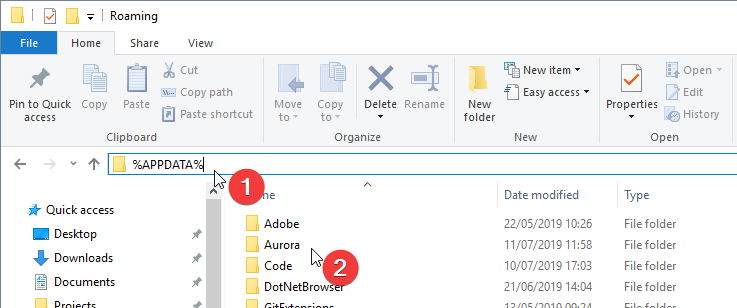

Aurora stores all user data in a directory in the roaming application data folder. This user data includes all your settings (such as preferred devices, bitmap accurracy, etc) as well as all your lighting profiles and recent logs that Aurora has created. You can see the Aurora folder by navigating to `%APPDATA%\Aurora` in Windows file explorer.

# Importing Profiles

Profiles that others have made can be imported easily into Aurora using the import button on the "Profiles" section. Pressing this button will open a dialog asking you to choose a file to import. JSON files that have been exported from Aurora (see [exporting profiles](#exporting-profiles)) are fully supported through import. In addition, Aurora has partial support for implementing iCUE profiles, however due to the nature of it being a different program with different layers and formats, imported profiles may not look identical.

When importing a profile, a new profile will appear in the profile list - you do not need to worry about it overwriting the profile you currently have selected. If you wish to merge the imported profile with an existing one you have, you can select the layers from one profile and copy and paste them using the relevant buttons or by pressing the Ctrl + C and Ctrl + V keys on the keyboard.

# Exporting Profiles

If you have created a profile that you wish to share with other people, you can easily export it by clicking the export button on the "Profiles" section. Clicking this button will open a window where you will be asked to save the profile as a JSON file. This JSON file can then be sent to other people who can import it into Aurora using the method described above. There is no way to export Aurora profiles into other applications such as LGS or iCUE.

# Taking a Backup

There amy be times when it would be wise to take a backus of your enitre Aurora data folder (for example when you are installing a test build of Aurora). Doing this is a very simple matter of duplicating a folder.

1. First, open up Windows file explorer.
1. In the address bar, type `%APPDATA%` and press enter. This will take you to the folder where various installed programs can store data for your user account.
1. There will be a folder called "Aurora" in here. Simply copy that folder to a different location (for example your Documents).

1. Should you need to restore data that's been backed up in future, you can simply replace the sane Aurora direction with the backup folder.

# Clearing User Data

Clearling your user data may be required if you start using test versions of Aurora or need to downgrade your Aurora installation for whatever reason. To do this, you can simply delete (or rename/move if you intend to reuse to this data some time) the Aurora folder.

1. First, ensure that you have closed Aurora. Deleting data while Aurora is running may cause it to crash. Additionally, Aurora will write some data to it's user data folder when it closes.
1. Next, open up Windows file explorer and in the address bar, type `%APPDATA%` and press enter. This will take you to the roaming application data folder.
1. There will be a folder called "Aurora" in here. Simply delete, move or rename that folder.
1. When you next re-open Aurora, it will recreate all the neccessary data with the default configuration: default settings, default profiles, etc.
