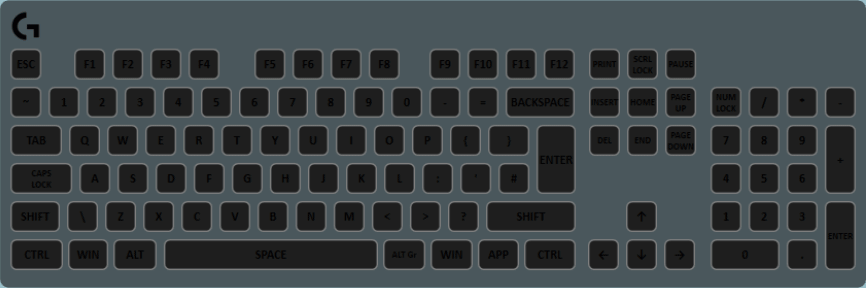

The animation layer is another very powerful but very complex and hard-to-use layer. It allows for you to create custom animations using shapes and by creating key-frames in the animation editor. There is a basic guide on how to create animations [here](../advanced-topics/animation-editor.html).

This layer can also be triggered when certain events happen. You can select it for when a game-state value changes or when you press/release a key. When in a key-mode, the animation can optionally be translated to the location of the pressed key. This basically provides a means of creating a custom interactive layer if you don’t like that layer’s default effects.

## Properties

Name|Description
-|-
Display Only on Key Sequence Keys|If this is selected, the animation will only be displayed on the keys in the Affect Keys list.
Scale to Key Sequence bounds|If this is checked, the animation bitmap will be scaled and translated so that it covers the keys in the Affected Keys list.
Affected Keys|If Display Only on Key Sequence Keys is checked, the animation will only be displayed on these keys.
Animation Duration|The length of time an animation takes to play. If you do not set this value high enough, the animation will appear to be cut off as it ends too early.
Repeat Times|The amount of times the animation will repeat. If set to 0, it will repeat indefinitely. When the trigger is not "Always on", this should not be set to 0 as once triggered the animation will carry on forever.
Trigger|This option is how you set when the animations should be played. The sub-properties for each of these trigger modes are detailed in the tabs below. "Always On" does not have any additional properties.

### Value Change Trigger Properties
<table>
  <thead>
    <tr>
      <th>Name</th>
      <th>Description</th>
    </tr>
  </thead>
  <tbody>
    <tr>
      <td>Trigger path</td>
      <td>A path to a number <a href="../advanced-topics/state-variables">State Variable</a> that should be watched for the value to change.</td>
    </tr>
    <tr>
      <td>Stack mode</td>
      <td>What should happen if the state variable changes again while an animation is already playing.<ul>
        <li><strong>Ignore</strong> - The currently playing animation will keep playing as if nothing happened.</li>
        <li><strong>Restart</strong> - Restart the currently playing animation.</li>
        <li><strong>Play Multiple</strong> - Play another instance of the animation in addition to the currently running one.</li>
      </ul></td>
    </tr>
  </tbody>
</table>

### Boolean Change Trigger Properties
<table>
  <thead>
    <tr>
      <th>Name</th>
      <th>Description</th>
    </tr>
  </thead>
  <tbody>
    <tr>
      <td>Trigger path</td>
      <td>A path to a boolean <a href="../advanced-topics/state-variables">State Variable</a> that should be watched for it to either become true, become false or run while true.</td>
    </tr>
    <tr>
      <td>Stack mode</td>
      <td>What should happen if the state variable changes again while an animation is already playing.<ul>
        <li><strong>Ignore</strong> - The currently playing animation will keep playing as if nothing happened.</li>
        <li><strong>Restart</strong> - Restart the currently playing animation.</li>
        <li><strong>Play Multiple</strong> - Play another instance of the animation in addition to the currently running one.</li>
      </ul></td>
    </tr>
  </tbody>
</table>

### Key Trigger Properties
<table>
  <thead>
    <tr>
      <th>Name</th>
      <th>Description</th>
    </tr>
  </thead>
  <tbody>
    <tr>
      <td>Trigger for any key</td>
      <td>If this is checked, any key press will trigger an animation. If unchecked, only the keys in Trigger Keys will cause an animation to play.</td>
    </tr>
    <tr>
      <td>Translate to pressed key</td>
      <td>If this is checked, the animation's origin point (0, 0) (top left) will be translated to the center point of the pressed key.</td>
    </tr>
    <tr>
      <td>Trigger keys</td>
      <td>The keys that should trigger an animation. Not needed if <em>Trigger for any Key</em> is checked.</td>
    </tr>
    <tr>
      <td>Stack mode</td>
      <td>What should happen if the state variable changes again while an animation is already playing.<ul>
        <li><strong>Ignore</strong> - The currently playing animation will keep playing as if nothing happened.</li>
        <li><strong>Restart</strong> - Restart the currently playing animation.</li>
        <li><strong>Play Multiple</strong> - Play another instance of the animation in addition to the currently running one.</li>
      </ul></td>
    </tr>
    <tr>
      <td>Stop as soon as key released</td>
      <td>If this is checked, the animation will immediately stop when the key is released. I.E. it will not wait for the animation to finish playing.</td>
    </tr>
  </tbody>
</table>