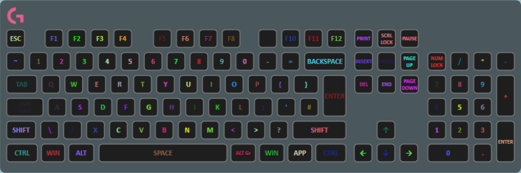

The glitch layer simply randomizes each key’s color every time it updates. The frequency of the update is configurable.

## Properties

Name|Description
-|-
Update Interval|The time in seconds between the key's randomization.
Allow Transparency|If true, the random color may be transparent.