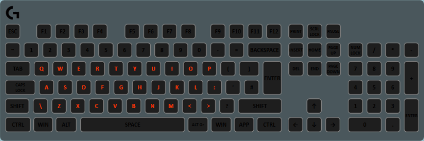

This layer sets all the specified keys to the same color, determined by the gradient. Unlike the regular gradient layer, all keys are the same color. You can think of the gradient as being a “timeline”, and the colors of all the keys are set based on how far through the timeline we are. This can be used to create a fade effect between multiple different colors.

## Properties

Name|Description
-|-
Gradient|The gradient that will be used to set the keys's color to. 
Effect Speed|The speed that the colors of the keys change. Higher = faster.
Fill keyboard canvas|Tick this to fill the whole keyboard with the gradient instead of the *affected keys*.
Affected Keys|A collection of keys that will be set to the target color.