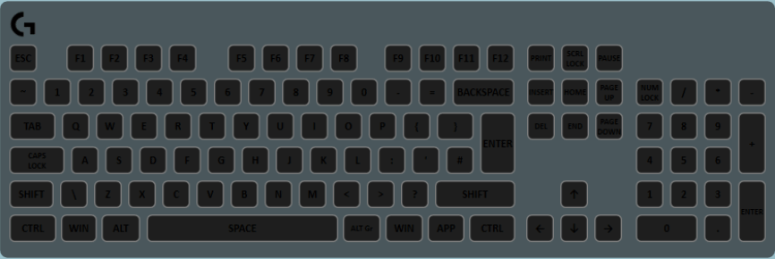

The interactive layer listens for key presses on the keyboard and plays an animation from that key. This can be used to make ripple effects (as shown in the GIF below) or have the key light up and slowly fade out when it’s been pressed.

## Properties

<table>
  <thead>
    <tr>
      <th>Name</th>
      <th>Description</th>
    </tr>
  </thead>
  <tbody>
    <tr>
      <td>Interactive Effect Type</td>
      <td><ul>
        <li><strong>Key Wave</strong> - A circle emerges from the pressed key and slowly expands. It is initially <em>Primary Color</em>, then fades to <em>Secondary Color</em>.</li>
        <li><strong>Key Fade</strong> - The pressed key turns the into the <em>Primary Color</em> then fades to <em>Secondary Color</em> then fades out.</li>
        <li><strong>Key Wave (Filled)</strong> - The same as "Key Wave" but is a filled circle rather than only a border.</li>
        <li><strong>Arrow Flow</strong> - A rectangle with a constant height is created at the location of the pressed key and it slowly increases in width.</li>
        <li><strong>Key Wave (Rainbow)</strong> - Same as "Key Wave" but the circle takes on a gradient color, with blue in the inner side and red on the outer side.</li>
      </ul></td>
    </tr>
    <tr>
      <td>Primary Color</td>
      <td>The solid color to set all the affected keys to during the first half of the animation.</td>
    </tr>
    <tr>
      <td>Use Random Primary</td>
      <td>Tick this to use a random color during first part of the animation instead of using <em>Primary Color</em>.</td>
    </tr>
    <tr>
      <td>Secondary Color</td>
      <td>The solid color to set all the affected keys to during the second half of the animation.</td>
    </tr>
    <tr>
      <td>Use Random Secondary</td>
      <td>Tick this to use a random color during second half of the animation instead of using <em>Secondary Color</em>.</td>
    </tr>
    <tr>
      <td>Effect Speed</td>
      <td>How quick the animation plays. Higher = faster.</td>
    </tr>
    <tr>
      <td>Effect Width</td>
      <td>How thick the circle lines are for the "Key Wave"s, or how tall the rectangle is for "Arrow Flow".</td>
    </tr>
    <tr>
      <td>Start when key released</td>
      <td>Whether to star the animation when the key is released, instead of when it is first pressed.</td>
    </tr>
    <tr>
      <td>Excluded Keys</td>
      <td>A collection of keys that will not trigger the animations (but will still show the animation if it passes over).</td>
    </tr>
  </tbody>
</table>