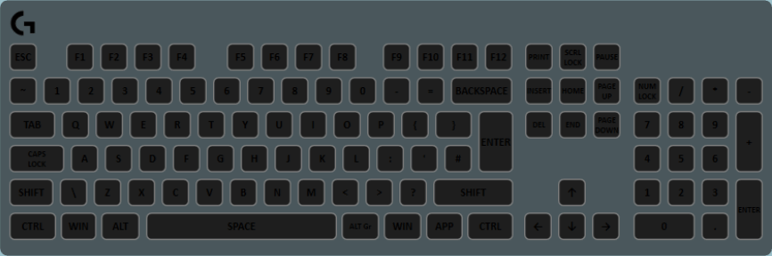
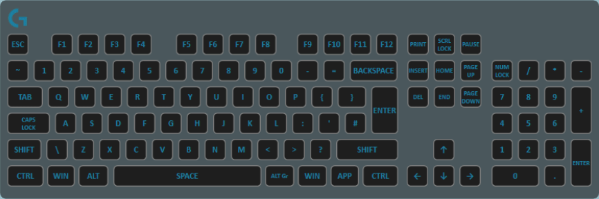

The lock layer allows you to have keys light up (or pulse) in a color when one of the “lock” keys is active (caps lock, num lock or scroll lock). You can use this to make a warning for when caps lock is on for example, or perhaps turn off the lights on the numpad when the numpad is off.

This layer functionality can be incorporated using the Overrides System. That said, it is simpler to use this layer for the pulse feature than to use the Override System alternative.

## Properties

Name|Description
-|-
Lock Key|The type of key to check whether it is locked or not. Valid options are: Capital, Scroll and NumLock.
Off Color|The solid color to use when the lock key is disabled/off.
On Color|The solid color to use when the lock key is enabled/on.
Pulse|If checked, the On Color will fade in and out when the lock key is active (as shown in the first screencap above).