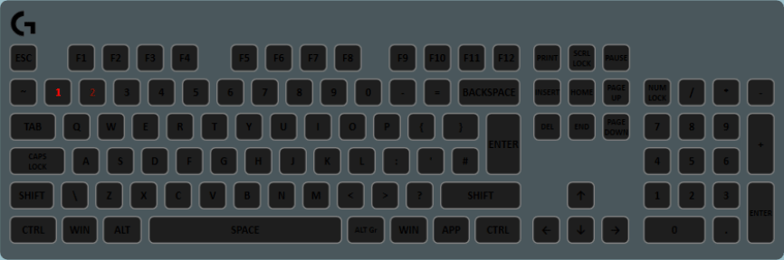

This layer is very similar to the Percent Effect Layer, but makes use of a gradient instead of a progress/background color. This layer does not have a background.

## Properties

<table>
  <thead>
    <tr>
      <th>Name</th>
      <th>Description</th>
    </tr>
  </thead>
  <tbody>
    <tr>
      <td>Current Value</td>
      <td>The path of a <a href="../advanced-topics/state-variables">State Variable</a> or a number. This value represents the current value of whichever variable you are watching, e.g. health, ammo, etc.</td>
    </tr>
    <tr>
      <td>Maximum Value</td>
      <td>The path of a <a href="../advanced-topics/state-variables">State Variable</a> or a number. This value represents the value that is the maximum value of the percent layer. This will be your max health, or max ammo etc.</td>
    </tr>
    <tr>
      <td>Percent Gradient</td>
      <td>A gradient brush whose color will define the color the affected keys will take.</td>
    </tr>
    <tr>
      <td>Background Color</td>
      <td>For progressive effect types: the color that will appear if the key is not being shown in progress color. For "all at once": the color that will be mixed with the progress color depending on the current/max ratio.</td>
    </tr>
    <tr>
      <td>Effect Type</td>
      <td><ul>
        <li><strong>All at once</strong> - All keys in the <em>affected keys</em> sequence share the same color. This color will be given by a blend of progress and background depending on the current/max ratio. For example: if progress is green, background is blue, current is 30 and max is 100: all the keys will be set to a blend of 30% green, 70% blue.</li>
        <li><strong>Progressive/Progressive (Gradual)</strong> - The keys will light up in percent gradient pattern when they are active. For example: if there are 10 keys in the affected key list, current is 30 and max is 100: the first 3 keys will be set to the color of the gradient, the others will not be set.</li>
      </ul></td>
    </tr>
    <tr>
      <td>Blink Threshold</td>
      <td>If the current/max percentage is less than this value, the "active" keys will fade in and out.</td>
    </tr>
    <tr>
      <td>Reverse Blink Threshold</td>
      <td>If this is true, the current/max percentage must be greater than the threshold for the active keys to flash.</td>
    </tr>
    <tr>
      <td>Affected Keys</td>
      <td>A collection of keys that will display the progress bar or color. Note that for progressive effect types, the order of the keys in the list matters.</td>
    </tr>
  </tbody>
</table>