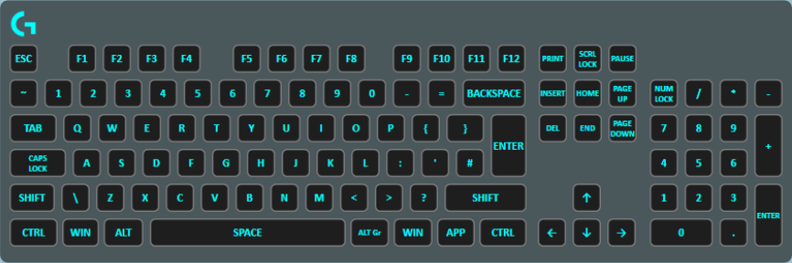

Similar to the Solid Color layer, however it does not have fine control over which keys are lit and so fills the entire canvas (keyboard, mouse and any other peripherals) with the given color. This layer is useful for setting static backgrounds, saving you from having to manually add each key.

## Properties

Name|Description
-|-
Color|The solid color to set all the affected keys to.