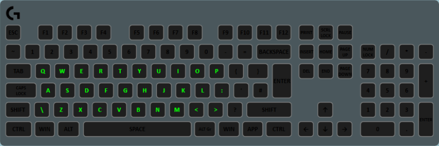

The timer layer waits for one or more keys to be pressed (do not have to be the keys displaying the lights) and sets the color of the keys to be something else for a set duration, after which they return to their original color. This layer can be used for things such as ability timers for games that have no game state integration.

## Properties

<table>
  <thead>
    <tr>
      <th>Name</th>
      <th>Description</th>
    </tr>
  </thead>
  <tbody>
    <tr>
      <td>Default Color</td>
      <td>The color that the keys are by default and when the timer is not active.</td>
    </tr>
    <tr>
      <td>Active Color</td>
      <td>The color the keys turn when one of the triggers has been pressed.</td>
    </tr>
    <tr>
      <td>Duration</td>
      <td>The duration (in milliseconds) that the timer takes.</td>
    </tr>
    <tr>
      <td>Animation Type</td>
      <td><ul>
      <li><strong>OnOff</strong> - When the trigger is pressed, the <em>Affected Keys</em> turn to active color and stays there for the <em>Duration</em> then immediately goes back to default.</li>
      <li><strong>Fade</strong> - When the trigger is pressed, the <em>Affected Keys</em> turn to active colors and then slowly fades back to the default color.</li>
      </ul></td>
    </tr>
    <tr>
      <td>Repeat Action</td>
      <td><ul>
      <li><strong>Reset</strong> - When a trigger is pressed while the timer is running, it will restart the timer anew.</li>
      <li><strong>Extend</strong> - When a trigger is pressed while the timer is running, it will extend the timer by <em>Duration</em>. E.G. if duration is 5000ms, and you press a trigger again 3000ms after pressing it for a first time, it would take 8000ms from the second press to completely reset.</li>
      <li><strong>Ignore</strong> - If a trigger is pressed while the timer is running, nothing will happen. The original timer will keep running as normal.</li>
      </ul></td>
    </tr>
    <tr>
      <td>Trigger Keys</td>
      <td>The list of keybinds that will cause the timer to run. These keys won't light up (unless you add them to the <em>Affected Keys</em>)</td>
    </tr>
    <tr>
      <td>Affected Keys</td>
      <td>The list of keys that will light up in default or active color. These keys will not trigger the timer.</td>
    </tr>
  </tbody>
</table>
