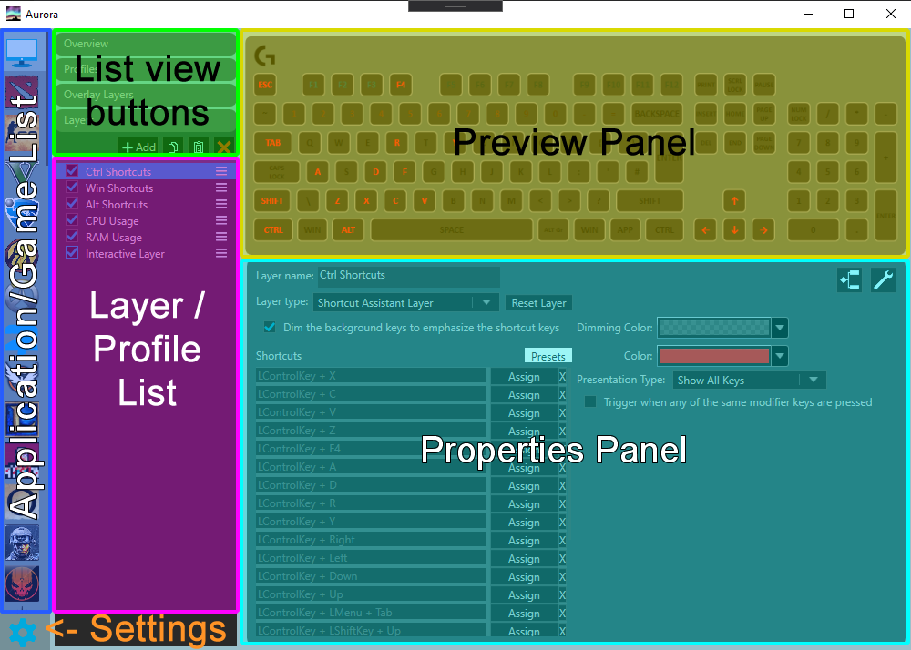

When you first open Aurora, you will be presented with a window that looks like the following.

1. **Enable device integrations**

    **Settings** -> Devices -> Enable all devices you want to use with Aurora.
    - See [Supported Devices]() for specifics.

2. **Select device layouts**

    **Settings** -> Devices & Wrappers
    - Go trough Keyboard, Mouse, Headset, and other devices and select the layouts you want to use.
      - Choose the layout that best matches your device.
      - If you want to use a custom layout, see [Advanced Topics/Custom Layouts]().

3. Enjoy the profiles!

    Aurora will automatically apply the default profile for each application you open.
    - See [Natively Supported Games]() for games and integrations that Aurora supports out of the box.
      - Some games and integrations may require additional setup.
    - See [Profiles]() to learn about Profiles & Layers.