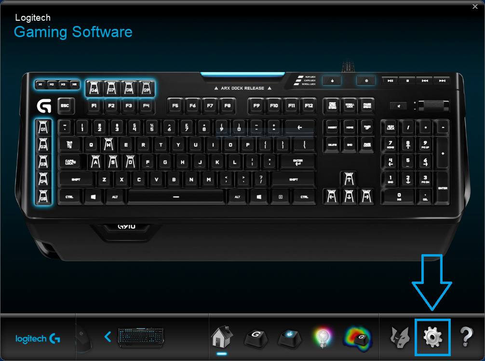
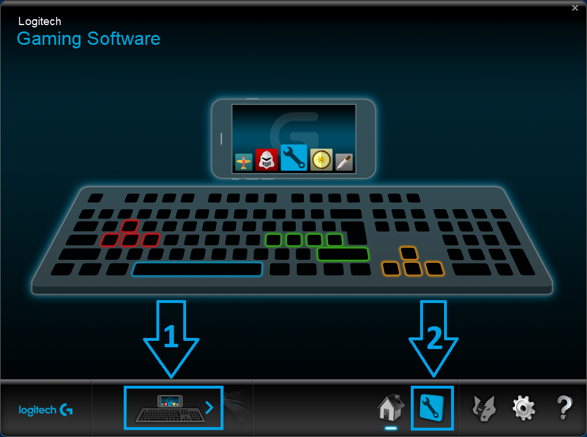
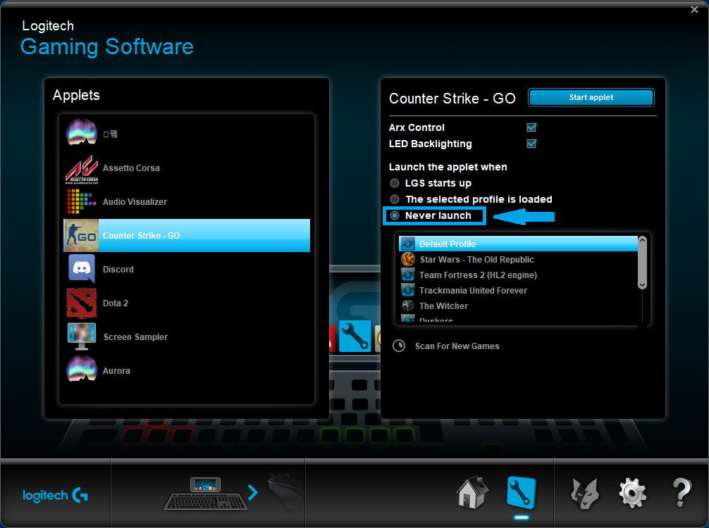
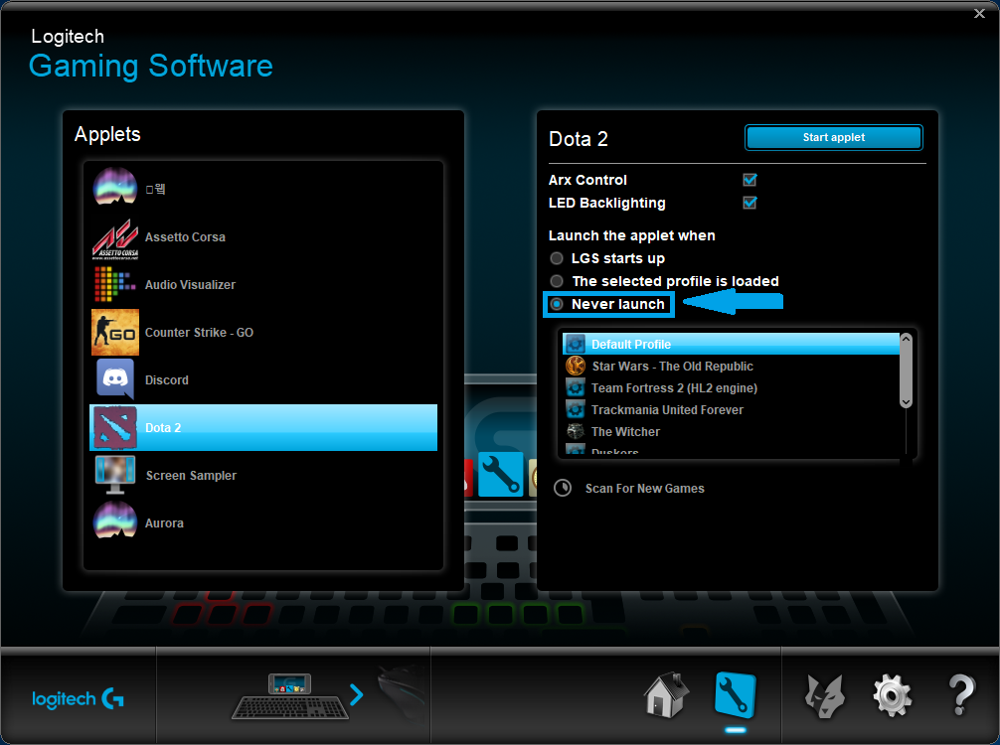
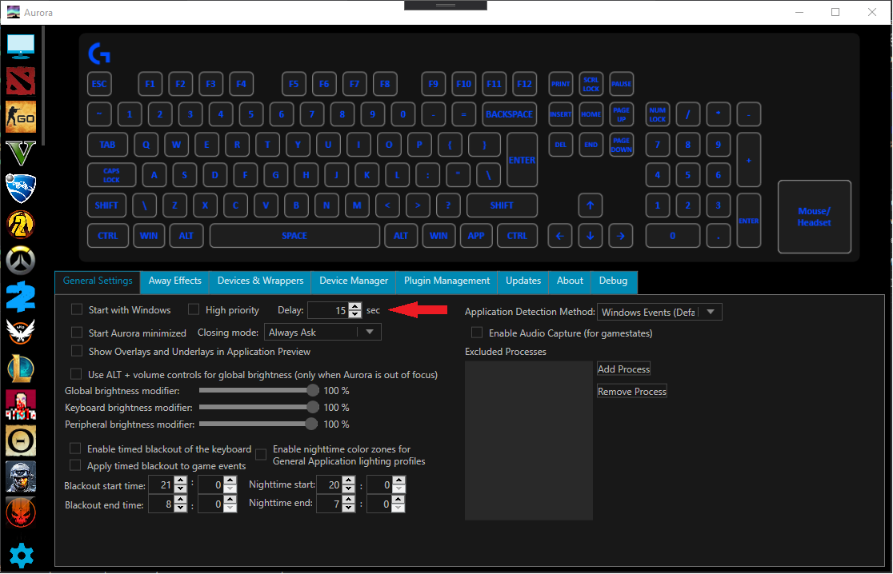

You can use Aurora profiles and brand specific integrations (like Chroma) with Logitech devices using Aurora.

Exceptionally these devices cannot work with Logitech SDK or OpenRGB:
- G502X (this exact model)

## Required Software

One of:

* Logitech Gaming Software 9.02.65+
* Logitech G Hub
* OpenRGB

## Needed configuration

{}
The SDK should come enabled by default when you install LGS or GHUB, but in case it doesn't connect, make sure it is enabled.

### For GHUB:

### For LGS:

1. Open Logitech Gaming Software and go into Settings

2. Enable Game Integration Settings

3. Open the Game Integration Configuration menu

4. Disable Conflicting Settings and Applets

## Known issues

* Lightsync wrapper will be automatically disabled if Logitech software autorun is detected.
If you want to use Logitech devices with other brands and have Lightsync integration on all devices, you have to replace Logitech software with [OpenRGB]({})

* G HUB can take a very long time to fully open and start receiving SDK requests. Because of this, on some systems Aurora tries to connect to G HUB before it has the chance to completely start. This causes any following connections to fail until both G HUB and Aurora are restarted. This can be fixed on boot by adding a delay to the task Aurora uses to startup. This can be done in the General Settings:

* Sometimes G HUB will only display Aurora's lighting when the window is open on the foreground. To fix this, setting the desktop profile to permanent may be needed.

## Supported Devices

### Keyboards

All per-key RGB keyboards are supposed to work. These are confirmed keyboards:
* G910
* G410
* G810
* GPRO
* G815
* G513

### Mice

All mice are supposed to work, these are confirmed mice:
* G900
* G502, **NOT G502X**

### Mousepads

{}

### Adding Support for New Devices
If the device you want it to be supporte is not G502X, please open an issue on [RGB.NET GitHub](https://github.com/DarthAffe/RGB.NET/issues).

