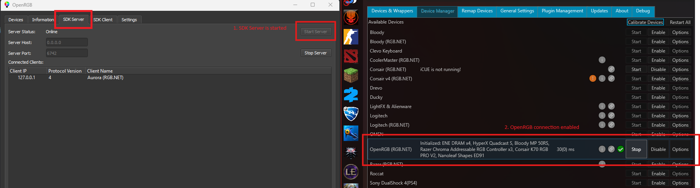
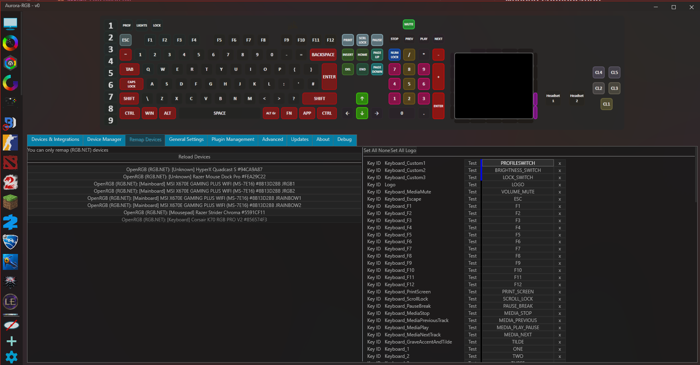

You can use Aurora with OpenRGB for ultimate lighting control, integration, performance and compatibility.
And of course, you can use [Game-specific Profiles]()
and [Brand Integrations]() with it.

## Required Software

[OpenRGB](https://openrgb.org/)

## Needed configuration

1. Enable SDK Server from OpenRGB

You can also make OpenRGB start at boot and enable SDK Server automatically from it's settings.
2. Make sure **OpenRGB (RGB.NET)** is enabled in Aurora's **Device Manager**

### Remapping LEDs
Device layouts in Aurora are automatically mapped by the LED names provided by OpenRGB.
Sometimes they may not be correct. In this case, you can use "Remap Devices" in Aurora settings to fix them.

### "Device is Detected in OpenRGB but not listed in Aurora"
For Aurora to use RGB devices safely, devices must support "Direct Mode"
Check [Wiki](https://github.com/Aurora-RGB/Aurora/wiki) for more details
