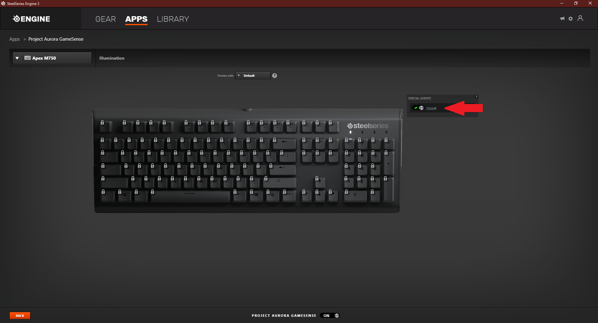

You can use Aurora profiles and brand specific integrations (like Chroma and Lightsync) with Steelseries devices using Aurora.

## Required Software

One of:
* SteelSeries Engine 3
* OpenRGB

## Needed configuration

The SDK should be enabled by default, but in case it's not, make sure the 'Project Aurora' custom application is enabled.

If you still cannot control your keyboard or mouse illumination, check if Color Special Event is enabled in Aurora applet in SSE.

## Known Issues

Devices with number of zones other than 1, 2 or 12 are not fully supported (ex. Rival 600) - they may still work but not all zones can be controlled.

## Supported Devices

Most devices supported by SteelSeries Engine. Notable exceptions are zone based keyboards like Apex M350 or Apex 3.
