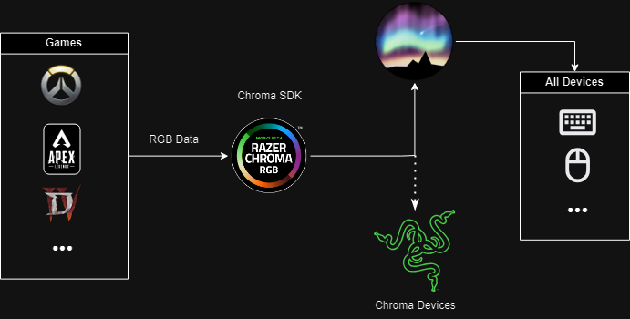

You can use Chroma integration with [all supported devices]() using Aurora

> Note that this is reverse engineered and may not work as the original.

You can have Synapse installed and Aurora will automatically apply game effects to your devices.
Then, "Razer Chroma SDK Service" needs to be running for the integration to work.

[Chrome Enabled Games List on www.razer.com](https://www.razer.com/chroma-workshop#--games)

In case game integration doesn't work,
use [Chroma Sample Application](https://discord.com/channels/427609830073696258/428606882064629761/1393688715611738242)
to test if the integration is working properly.

If it works with the sample application but not with Aurora,
Reinstall Chroma from Aurora and restart your computer.

Tip:

You can use the "Disable Device Control" button in "Devices & Wrappers" tab of Aurora to disable Chroma SDK from controlling Razer devices.

- RAZER is the trademark or registered trademark of Razer Inc.
