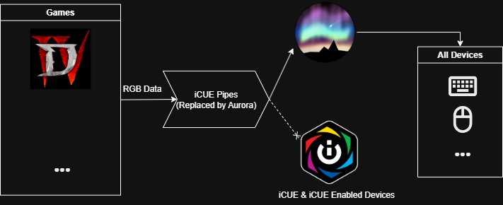

You can use iCUE integration with [all supported devices]() using Aurora

> Note that this is reverse engineered and may not work as the original.

Aurora can act as iCUE service and apply game effects to your devices.

[iCUE Enabled Games List on help.corsair.com](https://help.corsair.com/hc/en-us/articles/4403113239565-iCUE-What-games-support-RGB-integration-with-iCUE)

iCUE integration has 2 modes: SDK and Game State.

## SDK Mode
In SDK mode, iCUE service sends available device information to the game.
The game then sends lighting effects to the iCUE service.
A special profile with iCUE Layer is enabled in Aurora once a game is connected with SDK mode.

### Supported Games
- Diablo IV

Please let us know if there are more games supporting SDK mode.

## Game State Mode
In Game State mode, the game sends **state** and **event** information to the iCUE service.

Aurora intercepts these and the **state** information can be used in overrides with **iCUE** functions.
**Events** are not yet supported. Animations will have iCUE events as triggers in the future.

This mode requires new profiles for each game, which is a lot of work. Currently we don't have a profile for any game.
Help us by creating profiles for your favorite games
and share it in our [Discord](https://discord.gg/YAuBmg9) and we can add it as a default profile!

### Supported Games
- AgainstTheStorm
- BeyondContact
- BlackOps6
- BlairWitch
- Breakpoint
- Chernobylite
- Common
- CoreKeeper
- Dwerve
- Embr
- Far Cry New Dawn
- FarCry5
- FarCry6
- Flintlock
- FreshlyFrosted
- Gamedec
- Ghostrunner
- GridForce
- HelloNeighbor2
- Hyperscape
- INMOST
- IXION
- LayersOfFear
- MetroExodus
- MidnightGhostHun
- OldWorld
- Overloop
- PHOGS!
- PlagueTaleRequie
- ProjectWinter
- RedSolstice2
- RhythmSprout
- SerialCleaners
- SeveredSteel
- ShipOfFools
- SIFU
- Starmancer
- SubnauticaBZ
- SuperMagBot
- SweetTransit
- TerraInvicta
- TheDivision2
- TheMedium
- TheSettlers
- Thymesia
- TribesOfMidgard
- Vesper
- Wonderlands