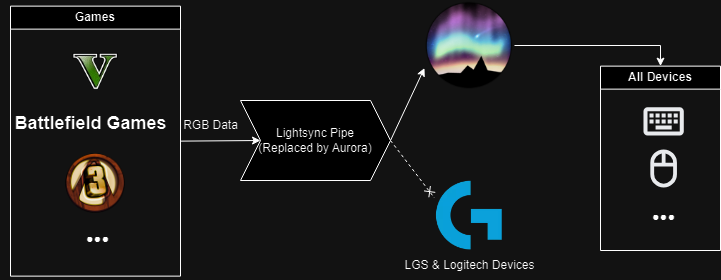

You can use Lightsync integration with [all supported devices]() using Aurora

> Note that this is reverse engineered and may not work as the original.

You can have LGS installed and Aurora will automatically apply game effects to your devices.

LGS must be fully closed before Aurora is launched.

In case a specific game integration doesn't work,
use [Lightsync Sample Application](https://www.logitechg.com/sdk/LED_SDK_9.00.zip)
to test if the integration is working properly.