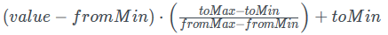
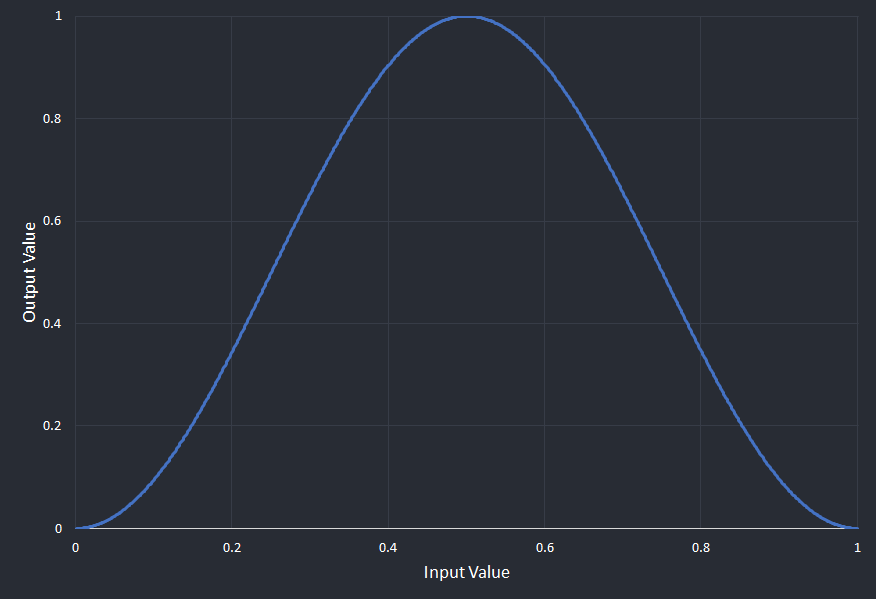
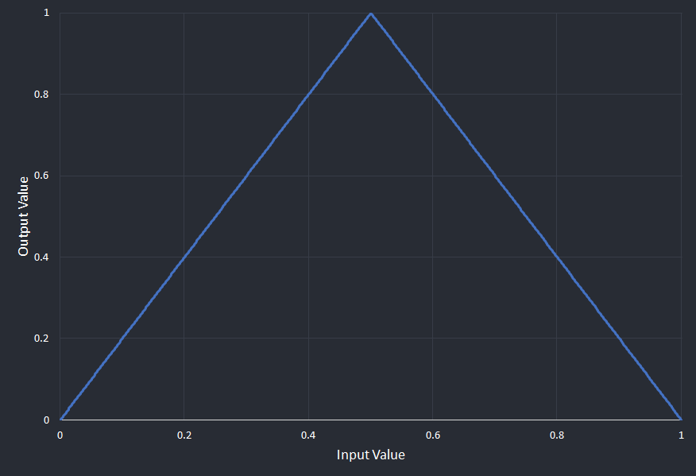

This page lists and explains the types of numeric expressions (sometimes called 'evaluatables') that you can use to construct your override logic. They are listed in the order they appear in the UI.

# State Variable

|Name|Description|
|-|-|
|Numeric State Variable|Fetches a numeric [state variable]({}) from the current application's game state and returns it.|

# Maths
<table>
  <thead>
    <tr>
      <th>Name</th>
      <th>Description</th>
    </tr>
  </thead>
  <tbody>
    <tr>
      <td>Absolute</td>
      <td>Takes another numeric expression and returns the positive equivalent of it. For example, 5 would simply return 5, but -10 would return 10.</td>
    </tr>
    <tr>
      <td>Arithmetic Operation</td>
      <td>Performs a simple binary mathematical operation on the two given numeric expressions. Operators are +, -, x, ÷ and mod. mod returns the remainder when operand 1 is divided by operand 2. For example, 4 mod 3 = 1, 4 mod 2 = 0, etc.</td>
    </tr>
    <tr>
      <td>Number Constant</td>
      <td>Represents a static number that you can set in the UI. This number will not change.</td>
    </tr>
    <tr>
      <td>Numeric Map</td>
      <td>Maps a value that is within one range onto another range. For example, consider we have the number 75 within the range 50 to 100. If we map that onto range 0 to 1, the result will be 0.5. This is because 75 is half way between 50 and 100, so it becomes half way between 0 and 1. It will also accept ranges that are inverse. For example, if we map the value 7 from the range 10 to 0 onto 0 to 100, the result is 30. This is because 7 is 30% of the way from 10 to 0.
      For the mathematically inclined, the exact equation is this: 
      Note that the output from this is clamped so that it will never go out of the "from" range of the function.</td>
    </tr>
    <tr>
      <td>Wave Function</td>
      <td>Performs a wave function with a period of 1 on the given input. The output will always be between 0 and 1. 
        <strong>Sine:</strong>  
        <strong>Triangle:</strong>
        For an example of how to use the wave functions, the RGB fade overrides demo makes use of the sine wave to gradually fade in and out the opacity of the layer.
      </td>
    </tr>
  </tbody>
</table>