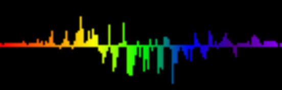

This layer takes in audio data from your computer and visualizes the volume at various frequencies. There are many different customization options for this layer including which frequencies should be detected. Which frequencies are best depends on the type of audio you expect to be playing (rock will be different from classical) but the default frequencies provide a good starting point.

## Properties

<table>
  <thead>
    <tr>
      <th>Name</th>
      <th>Description</th>
    </tr>
  </thead>
  <tbody>
    <tr>
      <td>Equalizer Effect Type</td>
      <td><ul>
        <li><strong>Power Bars</strong></li>
        <li><strong>Waveform</strong></li>
        <li><strong>Waveform (From bottom)</strong></li>
      </ul></td>
    </tr>
    <tr>
      <td>View Type</td>
      <td><ul>
        <li><strong>Solid Color</strong> - The waveform/bars are displayed in a single color (Primary Color)</li>
        <li><strong>Alternating Colors</strong> - Each bar alternates between Primary and Secondary color.</li>
        <li><strong>Gradient Notched Color</strong> - Each bar is a single color based on the Gradient provided.</li>
        <li><strong>Gradient Color Shift</strong> - The whole waveform is a single color as given by the gradient. The color gradually changes over time.</li>
        <li><strong>Gradient (Horizontal)</strong> - The waveform is colored as the Gradient provided.</li>
        <li><strong>Gradient (Vertical)</strong> - The waveform is colored as the Gradient provided vertically.</li>
      </ul></td>
    </tr>
    <tr>
      <td>Primary Color</td>
      <td>The color used when View Type is "Solid Color" or used for every other bar when View Type is "Alternating Colors".</td>
    </tr>
    <tr>
      <td>Secondary Color</td>
      <td>The color used for every other bar when View Type is "Alternating Colors".</td>
    </tr>
    <tr>
      <td>Gradient</td>
      <td>The gradient used when View Type isn't "Solid Color" or "Alternating Colors".</td>
    </tr>
    <tr>
      <td>Max Amplitude</td>
      <td>The value that will be used as the maximum value of the waveform. If the bars frequently clip off the top/bottom of the bitmap, try decreasing this value.</td>
    </tr>
    <tr>
      <td>Scale with System Volume</td>
      <td>Whether or not the max amplitude should automatically scale with the system volume.</td>
    </tr>
    <tr>
      <td>Dim Background on Sound</td>
      <td>If this is selected, when a sound is played the Dim Color will be used to dim the background.</td>
    </tr>
    <tr>
      <td>Dim Color</td>
      <td>The color used to dim the background by when Dim Background on Sound is selected.</td>
    </tr>
    <tr>
      <td>Frequencies</td>
      <td>A list of all frequencies that will be represented by bars when the Effect Type is set to "Power Bars". You may need to tweak or add/remove this values to get the best experience depending on the type of audio you expect to be played.</td>
    </tr>
  </tbody>
</table>