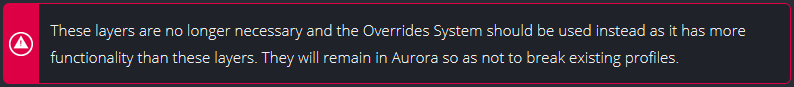

# Aurora Documentation

This is the Jekyll documentation for the Aurora RGB lighting software.

- [About](#about)
	- [Markdown](#markdown)
	- [Front-matter](#front-matter)
	- [Navigation](#navigation)
	- [Images](#images)
	- [Alerts](#alerts)
- [Contributing](#contributing)

## About

To contribute pages or edits to the documentation, the directory you will need is `_docs`. Any markdown files in here will be added to the site.

### Markdown
The documentation pages are written in markdown, and are stored in the `_docs` folder under sub-folder which relates to whichever category the page is in.

In the markdown files, you can mix and match markdown and HTML. Though more complex, HTML is useful in some conditions where vanilla markdown can't achieve something, such as having a images or lists inside a table. See `_docs\reference-layers\audio-visualizer.md` for an example of lists and images in a table.

### Front-matter
Each page has a small section of "front-matter" which is a YAML-encoded set of key-value pairs that provide metadata for the page. Without this, it will not be built by Jekyll so this is required. For the documentation pages, the only properties needed are:
 - `title` - The title of that particular page of the documentation. Will be shown at the top of the page and also in the browser's title bar.
 - `order` - The numeric order that this article will appear in the navigation list. More about this below.
 - `authors` - An array of all authors of the document. Each author's GitHub avatar and name will appear on the page as credit.

### Navigation
The navigation menu on the left is automatically generated, but needs a few metadata files to work. For each of the defined categories in `_data\categories.yaml`, it will create a heading in the navigation list. Then for each file in that category's assigned directory (defined in the YAML file), it will sort the documents by that file's `order` metadata, with a lower number being higher in the list. If multiple files exist with the same order value, they will end up defaulting to alphabetical order of the filename.

### Images

Images for the documentation should be stored in `assets\img\docs` (feel free to make a subfolder if you so desire). Images for the site (such as backgrounds or icons) should just be in `assets\img` or `assets\img\icons`.

Images can be added to the markdown using the normal markdown syntax, and should be referenced using a relative link.

For a document inside a category folder that is in `_docs`, the markdown would be:
```md

```

#### Alerts

There is a special HTML class that can be used to make boxes that contain important hints or warnings:
```html
<span class="alert info">...</span>
```
You can also use `danger`, `warning` or `success` in place of info to change the color.



## Setting up a local Jekyll environment

This is not required, but if you are making big changes then you may wish to preview them to ensure they are working first. To do this, you'll need to setup a local Jekyll instance to build the static site.

1. Install Ruby if you don't currently have it. There is a [simple guide on the Jekyll site](https://jekyllrb.com/docs/installation/).
1. Open the terminal in the directory in which you cloned this repo.
1. Install Jekyll using the command `gem install jekyll bundler` in your terminal.
1. Run the command `bundle install` to install the required Ruby gems.
1. Run the command `bundle exec jekyll serve` to make Jekyll build the static site and then host it.
1. Point your browser to `localhost:4000/Aurora-Docs` to view the site.

## Contributing

First, thank you for helping to improve the Aurora documentation!

Ensure you have read the about section to understand the structure of the project and how it works at a basic level.

Create your own fork of this repo, and then perform your changes:
- If you are creating a new page, add that page to the relevant category's directory in `_docs` and add the front matter. Use `_docs\.template` as a base if you want. Note that any file whose name starts with a `.` are ignored.
- If you are creating a new category, add a new entry to `_data\categories.yaml` with the name and path of files for the category. Next, create the folder (as named in the path property) and populate it with the documents that should appear under that category.
- If you want to edit the HTML structure of the site, the files in `_layouts` and `_includes` are the ones you need. If you want to edit the style of the site, the files in `_sass` are the ones you need to change.

Once you've made your changes, make a pull request back into the repo. Don't forget to write a little about what it does. It shall then be reviewed and you'll get feedback or it will be merged. :tada: